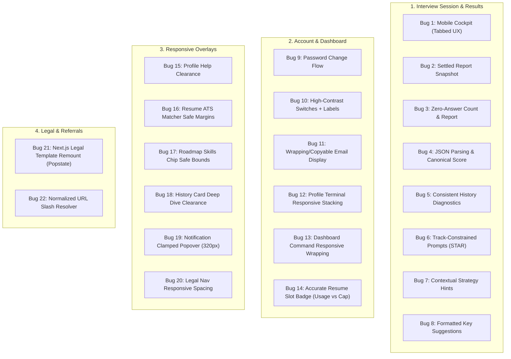

# Implementation Plan: UI Bugs and Recommended Fixes (22 Findings)

Comprehensive architectural and implementation plan to resolve all 22 findings documented in [interviewai-ui-bugs-and-fixes.md](file:///c:/Users/anant/Desktop/AI-AGENT/ai-interview-app/interviewai-ui-bugs-and-fixes.md).

---

## Goal Description
The audit identifies 22 user-facing defects across 4 major functional domains:
1. **Interview session and results (Bugs 1–8)**: Mobile interview viewport clipping, report score oscillation and zero-answer misreporting, raw JSON display in Detailed Analysis, contradictory history suggestions, malformed behavioral prompts & hints, and run-together key suggestions.
2. **Account and dashboard (Bugs 9–14)**: Change password button no-op, invisible settings switches, clipped profile email, overflowing terminal headers and shell commands at 320px/390px, and inconsistent resume slot availability badges.
3. **Responsive overlays and navigation (Bugs 15–20)**: Floating help button obstructing company suggestions, ATS audit button, roadmap skill tags, and history deep-dive links; notification popover clipped at 320px; and legal page header collision at 320px.
4. **Legal and referral navigation (Bugs 21–22)**: Browser Back state desync between `/terms#contact` and `/privacy`, and double slash in referral links (`//ref/`).

---

## User Review Required

> [!IMPORTANT]
> **Mobile Interview Cockpit UX (Bug 1)**: On desktop, the interview cockpit maintains a 3-column dense IDE layout (`[330px rail | 1fr editor | 300px coach]`). On mobile (`< 1024px`), we propose switchable tabs (`[ Question | Workspace | Coach ]`) with a fixed bottom action bar. This ensures the answer editor, language selector, and submit actions are 100% reachable without horizontal clipping, while allowing candidates to fluidly check the question briefing and coach feedback.
>
> When submitting an answer, the interface will automatically switch to or badge the **Coach** tab so candidates immediately view live feedback.

> [!NOTE]
> Several fixes in `app/dashboard/settings/page.tsx`, `components/ui/switch.tsx`, `components/help/support-widget.tsx`, and `components/resume/ats-matcher-card.tsx` were already initiated in your working tree. We will incorporate, refine, and verify those changes as part of this complete plan.

---

## Proposed Changes



---

### Component 1: Interview Session and Evaluation Engine (Bugs 1–8)

#### [MODIFY] [components/interview/interview-room.tsx](file:///c:/Users/anant/Desktop/AI-AGENT/ai-interview-app/components/interview/interview-room.tsx)
- **Bug 1 (Mobile Cockpit Layout)**:
  - Add state `mobileTab: 'briefing' | 'workspace' | 'coach'`.
  - Add a responsive mobile tab switcher (`flex lg:hidden`) beneath the header.
  - Wrap the 3 columns: on desktop (`lg:grid lg:grid-cols-[330px_1fr_300px]`), display all 3 panels side-by-side. On mobile (`< lg`), display only the active tab panel with `w-full min-w-0 flex-1`.
  - Remove fixed `w-[330px]` / `w-[300px]` constraints on mobile; use `w-full lg:w-[330px]` and `w-full lg:w-[300px]`.
  - Ensure the editor container and action bar (`SUBMIT →` / `NEXT →`) remain visible, accessible, and not clipped at 320px and 390px.
- **Bug 2 & Bug 3 (Report Count & Persistence)**:
  - Remove `setAnswersCount(1)` from `handleEndInterview`.
  - Calculate `answersCount` strictly from evaluated non-skipped answers:
    ```ts
    const realCompleted = mappedRecords.filter(r => r.userAnswer && r.userAnswer !== '(No answer provided)' && !isNonAnswer(r.userAnswer)).length;
    setAnswersCount(realCompleted);
    ```
  - In `handleEndInterview`, keep one immutable report snapshot so scrolling or re-renders never mutate the score, question breakdown, or completed count.
  - If `answersCount === 0`, show `0 OF 5 COMPLETED`, accuracy `--` (or `0%`), and render `"NO ANSWERS EVALUATED IN THIS SESSION"`.
- **Bug 4 (Detailed Analysis Raw JSON & Conflicting Score)**:
  - In `handleSubmitAnswer`, if `evalResult.feedback` contains serialized JSON (e.g. starts with `{` or contains `"score"`), parse it and extract the true `.feedback` string and `.score`.
  - Sync the scorecard, Caveman take, and Detailed Analysis to display the single canonical `score`.
- **Bug 7 (Behavioral Strategy Hints)**:
  - Determine hint text based on `currentQuestion.type` and `interviewType`:
    ```ts
    const isBehavioral = currentQuestion?.type === 'behavioral' || interviewType === 'behavioral';
    const hintText = isBehavioral
      ? "Structure your response using the STAR method (Situation, Task, Action, Result). Focus on leadership, cross-functional collaboration, measurable outcomes, and engineering trade-offs."
      : currentQuestion?.topic
        ? `Focus on core principles of ${currentQuestion.topic}. Outline assumptions, time/space complexity, and edge cases.`
        : "State your high-level approach first before diving into details. Outline constraints and edge cases.";
    ```
- **Bug 8 (Key Suggestions Formatting)**:
  - Create a helper `formatSuggestions(textOrArray: string | string[]): string[]` that splits on numbered delimiters (`1.`, `2)`), bullet points (`•`, `-`), or sentence boundaries (`/(?<=[.!?])\s+(?=[A-Z])/`).
  - Render suggestions as a semantic `<ul>` with `<li className="flex items-start gap-2">` and bullet indicators, with proper line spacing.

#### [MODIFY] [app/api/interview/chat/route.ts](file:///c:/Users/anant/Desktop/AI-AGENT/ai-interview-app/app/api/interview/chat/route.ts)
- **Bug 6 (Behavioral Prompts & Fallbacks)**:
  - When `interviewType === 'behavioral'`, tailor the prompt to generate STAR situational questions (e.g., project conflict, incident management, technical trade-offs for the role).
  - Update fallback questions: if `interviewType === 'behavioral'`, provide behavioral questions (e.g. *"Tell me about a high-stakes production incident you resolved..."*, *"Describe a technical dispute with peers..."*), instead of *"Explain the fundamental principles of [Role]"*.

#### [MODIFY] [app/api/interviews/[id]/evaluate/route.ts](file:///c:/Users/anant/Desktop/AI-AGENT/ai-interview-app/app/api/interviews/[id]/evaluate/route.ts)
- **Bug 4 & Bug 6 (Evaluation Sanitation & Prompts)**:
  - Validate and safely extract JSON feedback. If `feedback` is a stringified JSON object, parse it to extract clean strings for `feedback`, `technicalAccuracy`, and `improvements`.
  - In `finalize` mode: if generating fallback questions for unattempted sessions, check `interview.type`. If `behavioral`, generate role-appropriate behavioral questions, not technical principle prompts.

---

### Component 2: History and Diagnostic Views (Bugs 5, 8, 18)

#### [MODIFY] [components/history/history-session-card.tsx](file:///c:/Users/anant/Desktop/AI-AGENT/ai-interview-app/components/history/history-session-card.tsx)
- **Bug 5 (Contradictory History Suggestions)**:
  - If `overall_score === 0` or `weaknesses.length === 0`:
    - Instead of showing `"Good performance, keep practicing!"`, check if `overall_score === 0` or session was incomplete.
    - If unanswered/low score: display `"Session incomplete — practice answering all questions to generate improvement analytics."`
    - Only display positive sentiment when score >= 70.
- **Bug 18 (Floating Help Obscuring Deep Dive Link)**:
  - Add trailing safe margin to the "Read Full Question-by-Question Deep Dive" container: `pr-14 sm:pr-0 pb-2`.

#### [MODIFY] [components/history/question-eval-card.tsx](file:///c:/Users/anant/Desktop/AI-AGENT/ai-interview-app/components/history/question-eval-card.tsx)
- **Bug 8 (Key Suggestions in History Detail)**:
  - Parse `improvements` into list items using `formatSuggestions`, rendering as distinct `<li>` elements with bullet points and clear line spacing.

#### [MODIFY] [app/dashboard/history/[id]/page.tsx](file:///c:/Users/anant/Desktop/AI-AGENT/ai-interview-app/app/dashboard/history/[id]/page.tsx)
- **Bug 6 (Diagnostic Recovery Questions)**:
  - When creating recovery questions for sessions with 0 questions, check `interview.type`. If `behavioral`, use behavioral STAR scenarios rather than `"Explain the fundamental principles of Full Stack Developer"`.

---

### Component 3: Account, Dashboard & Resume (Bugs 9–14)

#### [MODIFY] [app/dashboard/settings/page.tsx](file:///c:/Users/anant/Desktop/AI-AGENT/ai-interview-app/app/dashboard/settings/page.tsx)
- **Bug 9 (Change Password)**:
  - Complete the password change form with show/hide password toggles, validation (min 6 characters, matching confirmation), Supabase `updateUser({ password })`, loading state, and toast feedback.
- **Bug 10 (Preference Switches Visibility)**:
  - Add visible status tags (`[ON]` / `[OFF]`) adjacent to each switch for unambiguous readability regardless of display contrast.

#### [MODIFY] [components/ui/switch.tsx](file:///c:/Users/anant/Desktop/AI-AGENT/ai-interview-app/components/ui/switch.tsx)
- **Bug 10 (Switch Styling)**:
  - Ensure track has high-contrast colors (`data-[state=checked]:bg-[#0F52BA] data-[state=unchecked]:bg-[#27273a] data-[state=unchecked]:border-[#383a52]`), thumb is crisp white (`bg-white shadow-md`), with clean transition and focus ring.

#### [MODIFY] [app/dashboard/profile/page.tsx](file:///c:/Users/anant/Desktop/AI-AGENT/ai-interview-app/app/dashboard/profile/page.tsx)
- **Bug 11 (Clipped Read-only Email)**:
  - Replace single-line overflow-hidden input with a responsive, selectable container showing the full email address, break-all text wrapping, and a one-click copy button with toast feedback.
- **Bug 12 (Profile Terminal Header and Command Overflow at 320px)**:
  - In the macOS title bar and command bar, add `min-w-0 flex-wrap`, allowing long titles and `engineer@interviewai:~/.config$ edit profile.env` to wrap cleanly or break words without exceeding the card edge.
- **Bug 15 (Floating Help Obscuring Company Suggestion)**:
  - Add safe bottom-right padding (`pb-8 pr-12 sm:pr-0`) to the suggested companies container so the floating help widget never overlaps any suggestion chip or remove button.

#### [MODIFY] [app/dashboard/page.tsx](file:///c:/Users/anant/Desktop/AI-AGENT/ai-interview-app/app/dashboard/page.tsx) & [components/resume/resume-dropzone.tsx](file:///c:/Users/anant/Desktop/AI-AGENT/ai-interview-app/components/resume/resume-dropzone.tsx)
- **Bug 13 (Dashboard Resume Terminal Command Mobile Column)**:
  - In `components/resume/resume-dropzone.tsx` and `app/dashboard/resume/page.tsx`, allow prompt and command to wrap (`flex-wrap gap-x-2 gap-y-1`) instead of squishing the command column into tiny fragments.
- **Bug 14 (Resume Upload Badge Available Slots)**:
  - In `components/resume/resume-dropzone.tsx`: compute available slots as `Math.max(0, 2 - storedResumes.length)`:
    - If 0 resumes stored: show `2/2 SLOTS AVAILABLE` (or `0/2 SLOTS USED`).
    - Standardize terminology across `ResumeDropzone` and `app/dashboard/resume/page.tsx`.

---

### Component 4: Responsive Overlays and Navigation (Bugs 15–20)

#### [MODIFY] [components/help/support-widget.tsx](file:///c:/Users/anant/Desktop/AI-AGENT/ai-interview-app/components/help/support-widget.tsx)
- **Bugs 15–18 (Help Widget Inset & Hit Target)**:
  - Scale help button appropriately on mobile (`bottom-3 right-3 h-10 w-10 sm:bottom-6 sm:right-6 sm:h-12 sm:w-12`).
  - Constrain modal width to `w-[calc(100vw-24px)] max-w-[310px]`.

#### [MODIFY] [components/resume/ats-matcher-card.tsx](file:///c:/Users/anant/Desktop/AI-AGENT/ai-interview-app/components/resume/ats-matcher-card.tsx) & [app/dashboard/resume/page.tsx](file:///c:/Users/anant/Desktop/AI-AGENT/ai-interview-app/app/dashboard/resume/page.tsx)
- **Bug 16 (ATS Audit Action Overlap)**:
  - Stack audit buttons on mobile (`flex-col-reverse sm:flex-row w-full sm:w-auto`).
  - Add container bottom padding `pb-32 sm:pb-16` to prevent fixed help overlap.

#### [MODIFY] [app/dashboard/roadmap/page.tsx](file:///c:/Users/anant/Desktop/AI-AGENT/ai-interview-app/app/dashboard/roadmap/page.tsx)
- **Bug 17 (Roadmap Focus Chip Remove Control)**:
  - Add `pr-14 sm:pr-2.5` to active focus tags container so the remove `(X)` button on the last chip never falls beneath the floating help button.

#### [MODIFY] [components/dashboard/notification-bell.tsx](file:///c:/Users/anant/Desktop/AI-AGENT/ai-interview-app/components/dashboard/notification-bell.tsx)
- **Bug 19 (Notification Popover Clipped at 320px)**:
  - Change popover sizing from fixed `w-[340px]` to `w-[calc(100vw-24px)] sm:w-[340px] max-w-[340px]`.
  - Clamp horizontal position so it stays within viewport bounds at 320px.

#### [MODIFY] [app/(legal)/layout.tsx](file:///c:/Users/anant/Desktop/AI-AGENT/ai-interview-app/app/%28legal%29/layout.tsx)
- **Bug 20 (Terms Header Collision at 320px)**:
  - Adjust navbar padding and spacing (`px-3 sm:px-6`, `gap-2.5 sm:gap-6`).
  - Add `whitespace-nowrap shrink-0` to `Sign In →` and brand.
  - Wrap links neatly on mobile screens without label collisions.

---

### Component 5: Legal and Referral Navigation (Bugs 21–22)

#### [NEW] [app/(legal)/template.tsx](file:///c:/Users/anant/Desktop/AI-AGENT/ai-interview-app/app/%28legal%29/template.tsx)
- **Bug 21 (Browser Back Privacy/Terms State Desync)**:
  - Add a client-side `LegalTemplate` that takes `pathname` as key.
  - This ensures Next.js creates a fresh component instance and unmounts the previous page whenever navigating or pressing Back/Forward between `/terms` and `/privacy`.
  - Handle anchor scrolling on `popstate` to properly scroll to `#contact` or target hash.

#### [MODIFY] [app/dashboard/referrals/page.tsx](file:///c:/Users/anant/Desktop/AI-AGENT/ai-interview-app/app/dashboard/referrals/page.tsx)
- **Bug 22 (Referral Link Doubled Slash)**:
  - Strip any trailing slashes from `appUrl`:
    ```ts
    const appUrl = (process.env.NEXT_PUBLIC_APP_URL ?? 'https://interviewai.app').replace(/\/+$/, '')
    referralLink={`${appUrl}/ref/${referralCode}`}
    ```

---

## Verification Plan

### Automated Tests
Run unit, lint, and build checks:
```bash
npm run build
```
Verify that TypeScript compilation passes and there are no syntax or type errors.

### Manual Verification
1. **Bug 1 (Mobile Cockpit)**: Emulate iPhone SE (320×568) and iPhone 14 (390×844) in Chrome DevTools on `/interview/[id]`. Verify all three tabs (Briefing, Workspace, Coach) are switchable, the code editor/text area and Submit button are visible and interactive, and there is no horizontal page overflow.
2. **Bug 2 & 3 (Report Count)**:
   - End an interview with 0 questions submitted: verify it reports 0/5 completed, accuracy `--` or `0%`, and empty breakdown.
   - Complete 5 questions and end: verify it reports 5/5 completed and that scrolling/waiting does not reset the count to 1/5.
3. **Bug 4 (Detailed Analysis)**: Submit an answer, verify Quick Evaluation and Detailed Analysis render clean text (no raw `{ "score": ... }` JSON) and identical scores.
4. **Bug 5 (History Diagnostics)**: Check a 0% completed session on `/dashboard/history`. Verify Suggestions displays a clear improvement message instead of "Good performance, keep practicing!".
5. **Bug 6 & 7 (Behavioral Prompts & Hints)**: Start a Behavioral session. Verify the generated questions are behavioral STAR scenarios, and the strategy hint guides through the STAR method instead of algorithm time/space complexity.
6. **Bug 8 (Key Suggestions)**: Verify suggestions render as distinct list items with bullet points and clean spacing.
7. **Bug 9 & 10 (Settings)**: On `/dashboard/settings`, click "Change Password" to open the form, verify password validation, and confirm switches have visible ON/OFF indicators and clear contrast.
8. **Bug 11 & 12 (Profile)**: On `/dashboard/profile` at 320px, verify email is completely readable and copyable, and terminal headers do not overflow.
9. **Bug 13 & 14 (Resume)**: On `/dashboard/resume`, verify empty slots show "2/2 SLOTS AVAILABLE" (or "0/2 SLOTS USED"), and command strings wrap cleanly on mobile.
10. **Bugs 15–18 (Help Widget Inset)**: On `/dashboard/profile`, `/dashboard/resume`, `/dashboard/roadmap`, and `/dashboard/history`, scroll to bottom and verify the floating help button does not cover any interactive buttons or chips.
11. **Bug 19 (Notifications)**: At 320px, click notification bell; verify the popover fits within the screen without truncating "Notifications".
12. **Bug 20 & 21 (Legal Pages)**: At 320px, view `/terms` header links. Click `#contact`, then click `Privacy Policy`, then click browser Back; verify URL `/terms#contact` renders Terms content and scrolls to Contact.
13. **Bug 22 (Referrals)**: On `/dashboard/referrals`, verify link contains a single slash (`/ref/<code>`), not `//ref/<code>`.
